🎙️ Deepfake Audio / Media Transcription & Analysis

A full-stack media transcription and analysis platform built with Python + Flask, supporting video, audio, text, YouTube ingestion, speaker diarization (beta), multi-language translation, and PDF report generation.

This project focuses on real-world media processing pipelines, not just a demo UI.

⸻

🚀 Features

Core Features
	•	✅ Video transcription (MP4, etc.)
	•	✅ Audio transcription (WAV, etc.)
	•	✅ Text file summarization
	•	✅ YouTube URL ingestion
	•	✅ Automatic summary generation
	•	✅ Downloadable transcripts (.txt)
	•	✅ Downloadable subtitles (.srt)
	•	✅ PDF transcription reports
	•	✅ In-browser media playback
	•	✅ Async job system for long tasks

⸻

🗣️ Speaker Diarization (Beta)
	•	Supports speaker-differentiated transcripts
	•	Automatically detects and labels speakers (S1, S2, …)
	•	Uses:
	•	Fast CPU diarization (VAD + embeddings + clustering)
	•	Optional PyAnnote pipeline (if HuggingFace token is provided)

⚠️ Diarization is marked Beta
Accuracy varies depending on audio quality, speaker overlap, and recording conditions.

⸻

🌍 Multi-Language Translation
	•	Translate transcripts per segment
	•	Translate generated summaries
	•	Language selectable via UI
	•	Easily extensible language support

Currently supported:
	•	Uzbek (uz)
	•	Russian (ru)
	•	And so on

⸻

📄 PDF Reports

Each job can generate a structured PDF report containing:
	•	Metadata (file name, generation time, mode)
	•	Summary (original + translated)
	•	Timestamped transcript
	•	Speaker labels (if diarized)
	•	Translated lines (if enabled)

⸻

🧠 Tech Stack

Backend
	•	Python 3.11
	•	Flask
	•	faster-whisper (local Whisper inference)
	•	PyAnnote (optional diarization)
	•	Resemblyzer + WebRTC VAD
	•	yt-dlp (YouTube ingestion)
	•	ReportLab (PDF generation)
	•	ThreadPoolExecutor (async jobs)

Frontend
	•	Server-rendered HTML (Jinja2)
	•	Bootstrap-based UI
	•	Progressive enhancement (no JS framework dependency)

⸻

⚙️ Setup Instructions

1. Clone the repo
	•	git clone https://github.com/orifhon74/transcripto.git
	•	cd transcripto
2. Create the virtual environment
	•	python3 -m venv .venv
	•	source .venv/bin/activate
3. Install dependencies
	•	pip install -r requirements.txt
4. (Optional) Environment Variables
	•	Create a .env file:
```
		  SECRET_KEY=dev
		  WHISPER_MODEL=base
		  DEVICE=cpu
		  COMPUTE_TYPE=int8
		      
		  # Optional (for better diarization)
		  HUGGINGFACE_TOKEN=your_token_here
		  DIARIZATION_MODE=auto
```
6. Run the app
	•	python app.py

Open:
👉 http://localhost:5050

⸻

🧪 Known Limitations
	•	Speaker diarization accuracy depends heavily on audio quality
	•	CPU-only inference can be slow for long videos
	•	Overlapping speakers reduce diarization accuracy
	•	Translation quality depends on model constraints
	•	No persistent storage (in-memory job/download system)

⸻

🔮 Future Improvements
	•	GPU-accelerated transcription (RunPod / local GPU)
	•	Per-language PDF labeling (not hardcoded to Uzbek)
	•	Persistent storage (Redis / PostgreSQL)
	•	Job progress UI
	•	Auth & user history
	•	Improved diarization clustering
	•	Model selection per job

⸻

🎯 Project Goal

This project was built to demonstrate:
	•	Real-world backend architecture
	•	Media processing pipelines
	•	Async task handling
	•	AI integration beyond simple APIs
	•	Clean refactoring and extensibility

⸻

## 📸 Screenshots

### Home & Inputs
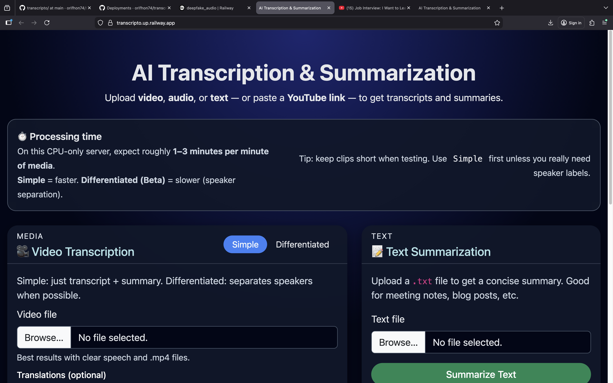
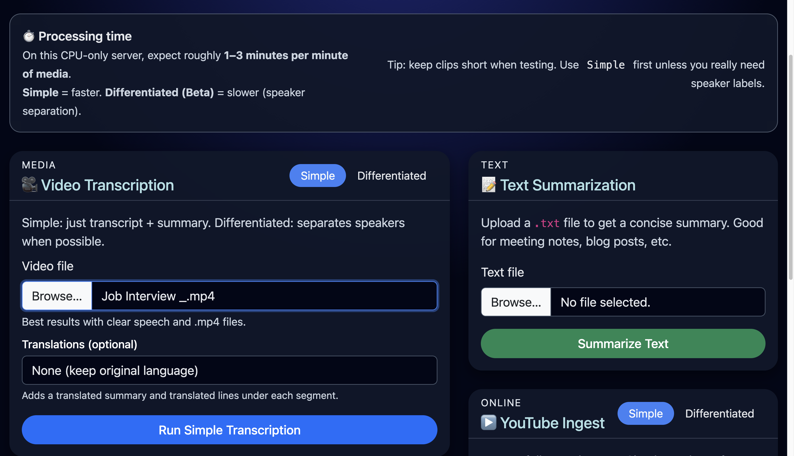
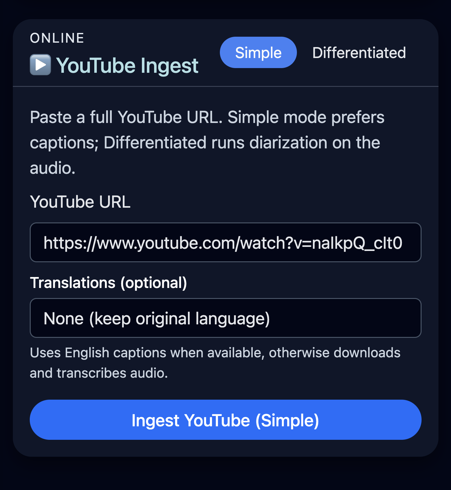

### Transcription Results

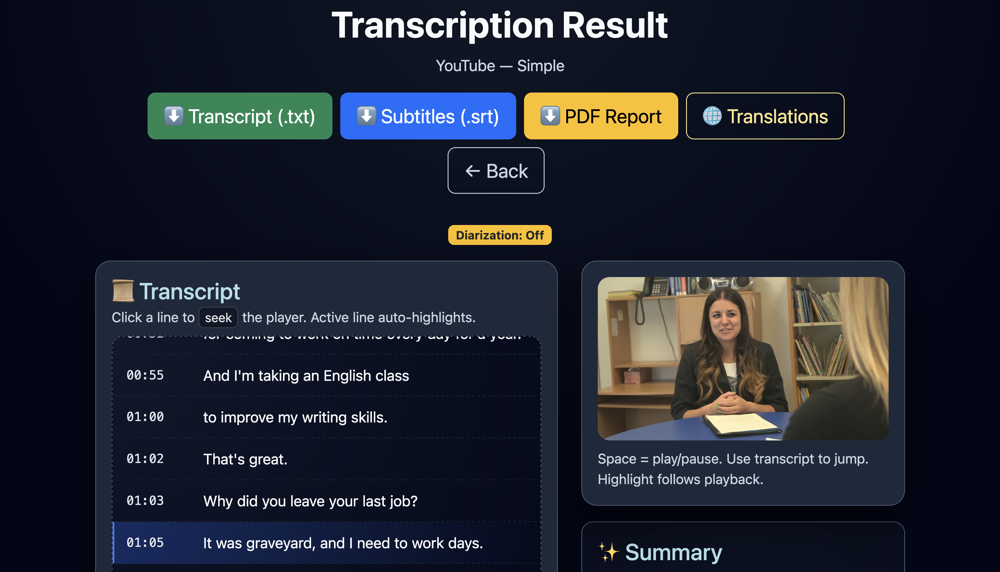

### Speaker Diarization (Beta)
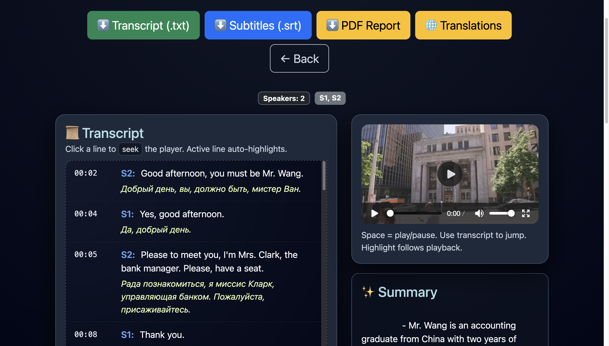

### Summaries & Translations
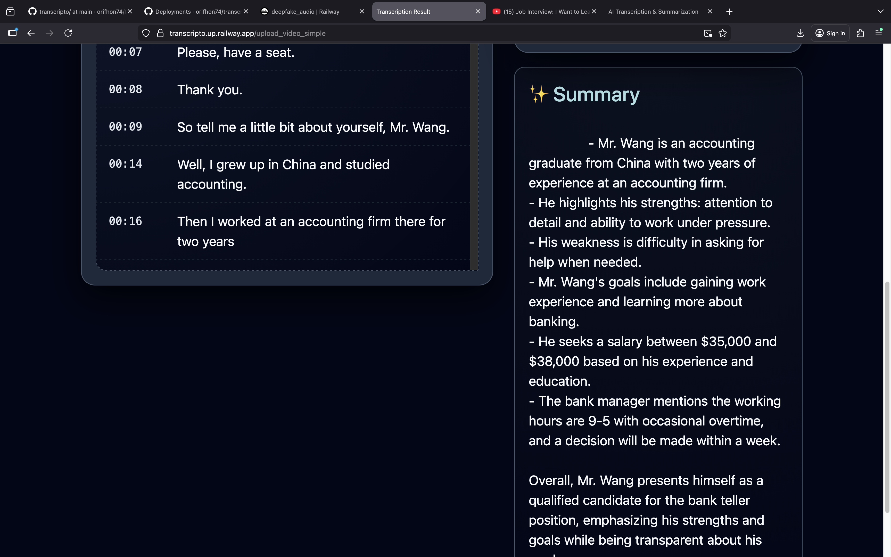
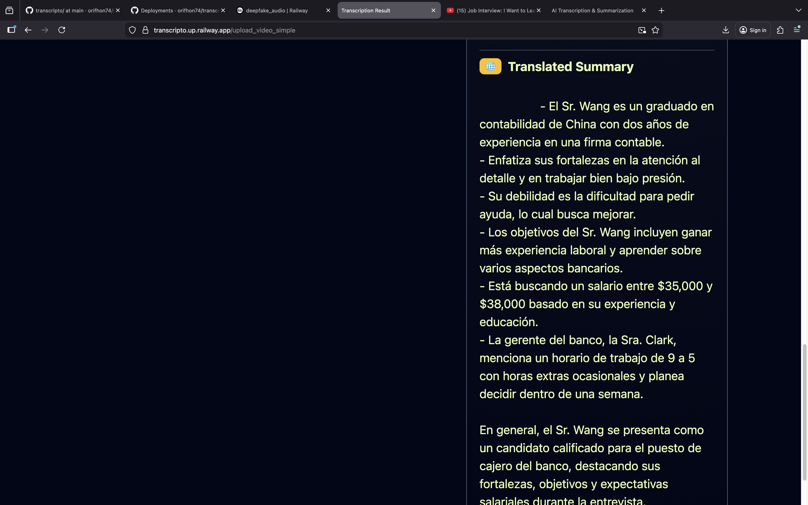
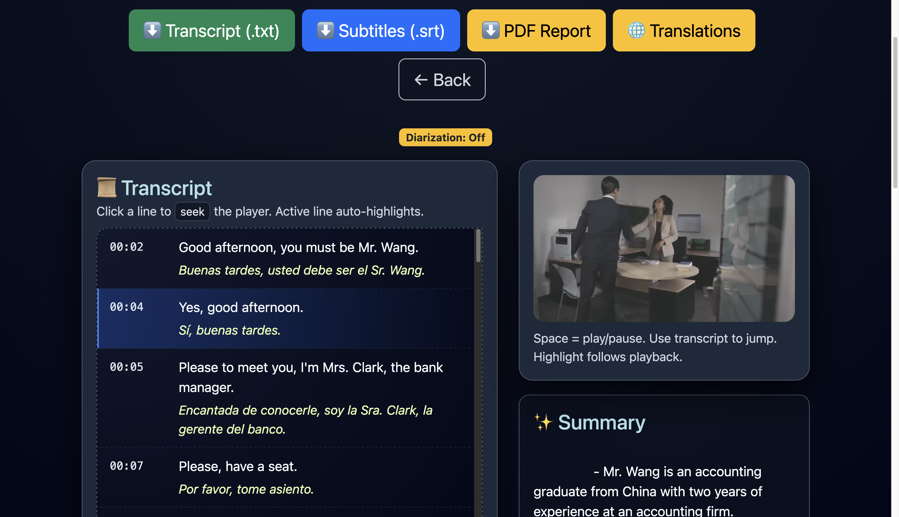

### PDF Reports
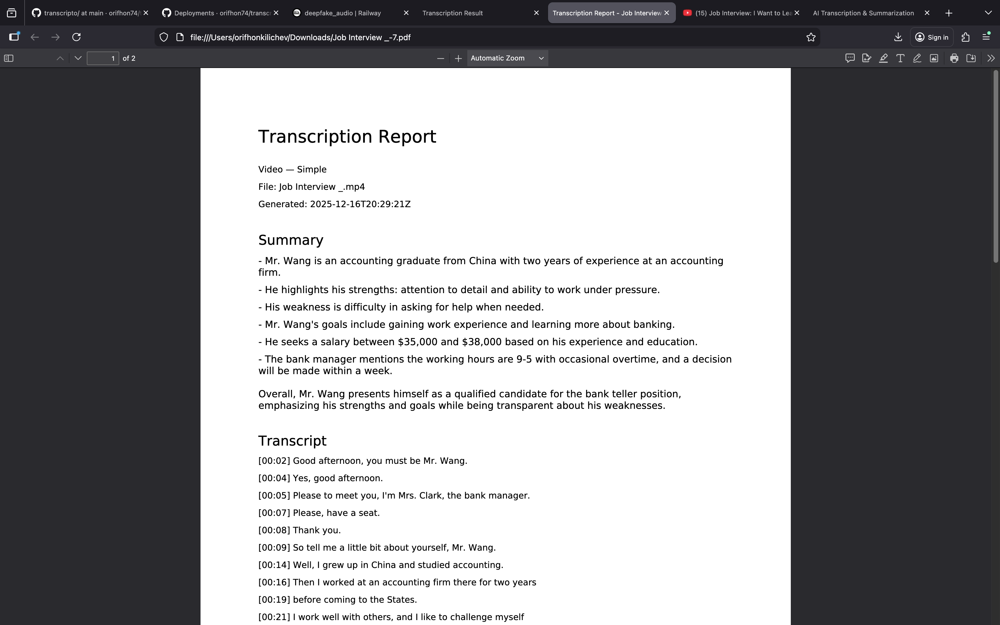
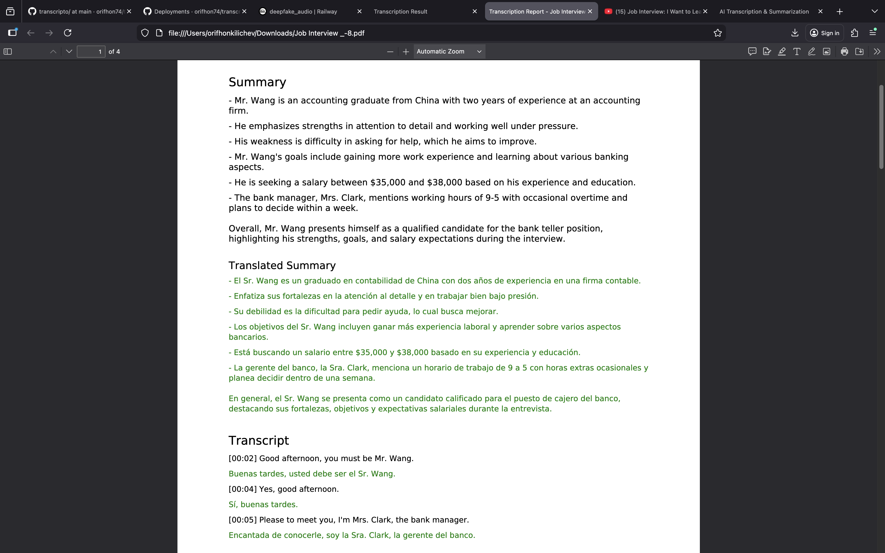
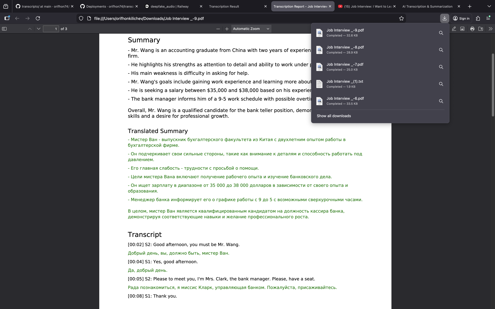

⸻

## ✅ Feature Matrix

| Feature                | Status |
|------------------------|--------|
| Video Transcription    | ✅ Supported |
| Audio Transcription    | ✅ Supported |
| YouTube Ingest         | ✅ Supported |
| Speaker Diarization    | ⚠️ Beta |
| Multi-language Output  | ✅ Supported |
| PDF Reports            | ✅ Supported |
| Async Jobs             | ✅ Supported |
| GPU Acceleration       | ❌ Planned |

⸻

👤 Author

Orifkhon Kilichev
Bachelor’s in Computer Science
Interested in backend systems, AI pipelines, and engineering-driven software.
