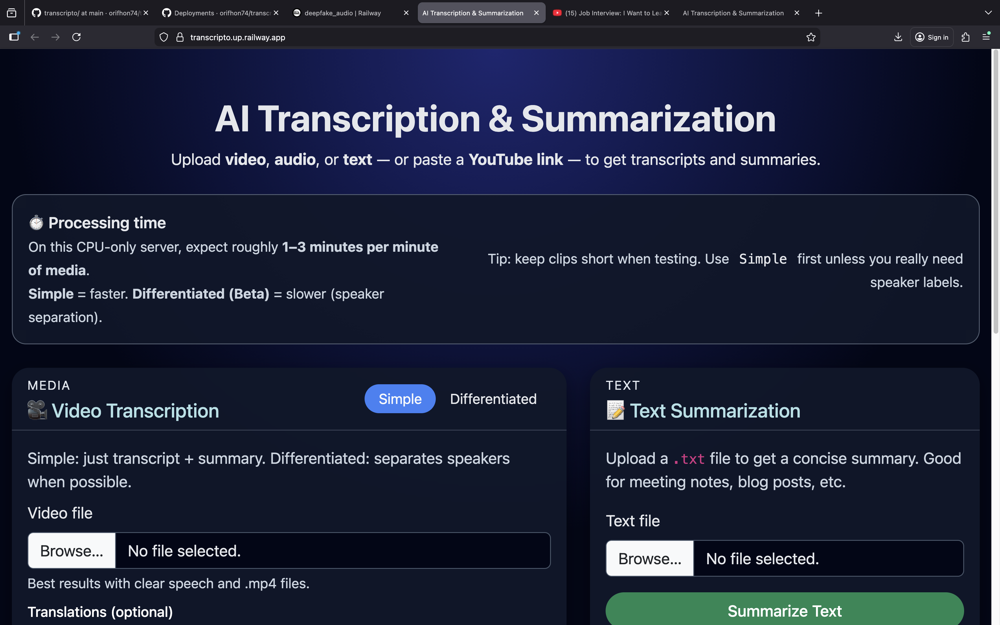
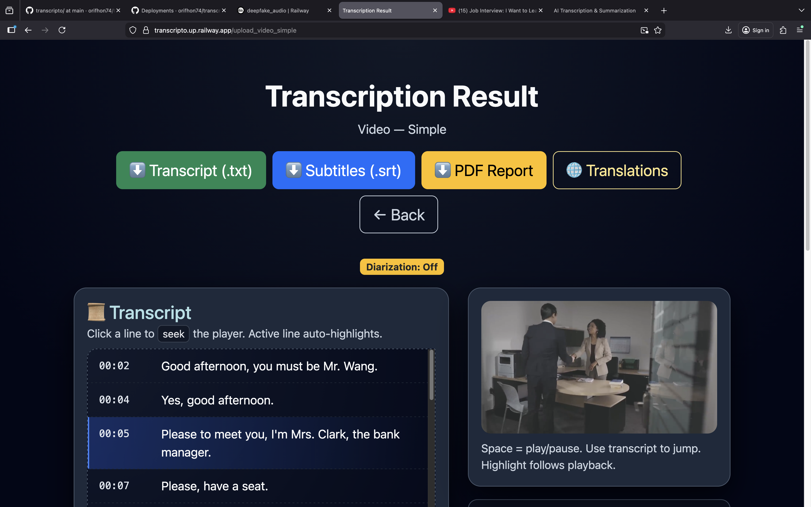
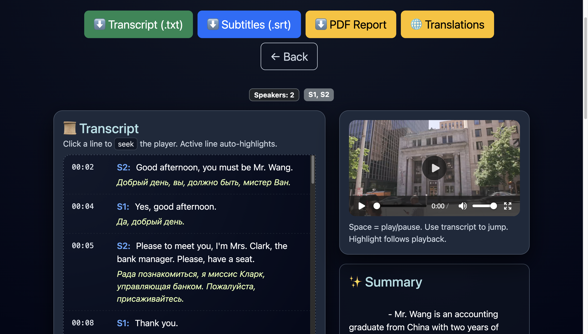
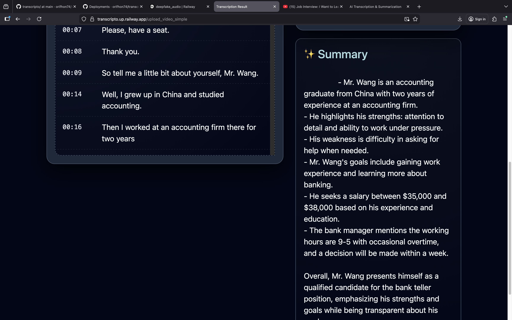
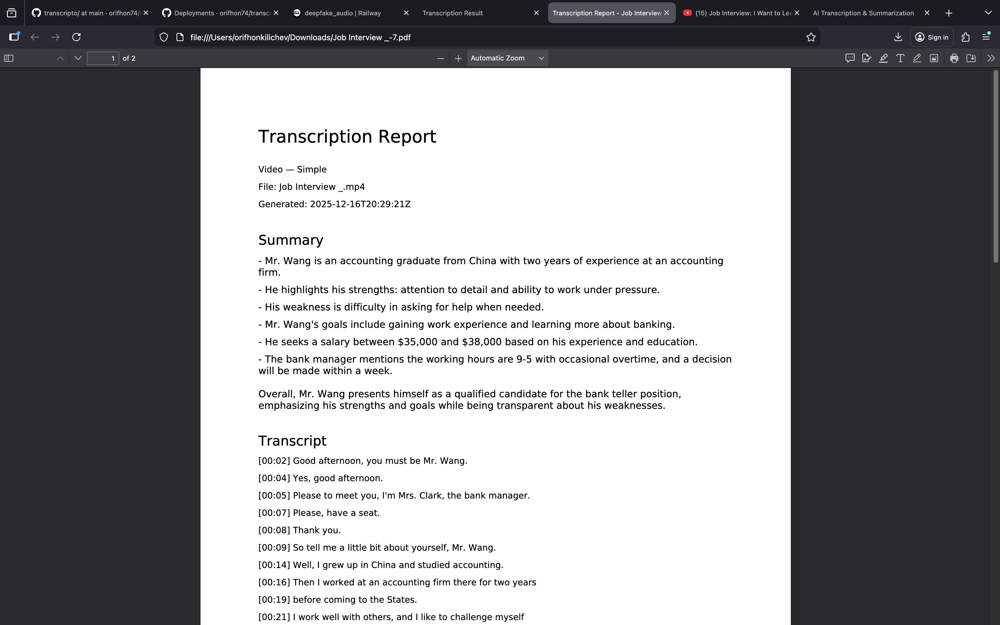

🎙️ Audio / Video / Media Transcription & Analysis

A full-stack media transcription and analysis platform built with Python + Flask, supporting video, audio, text, YouTube ingestion, speaker diarization, multi-language translation, and PDF report generation.

This project focuses on real-world media processing pipelines, not just a demo UI.

⸻

## 🌐 Live Demo
👉 https://transcripto.up.railway.app

⸻

🚀 Features

Core Features
	•	✅ Video transcription (MP4, etc.)
	•	✅ Audio transcription (WAV, etc.)
	•	✅ Text file summarization
	•	✅ YouTube URL ingestion
	•	✅ Automatic summary generation
	•	✅ Downloadable transcripts (.txt)
	•	✅ Downloadable subtitles (.srt)
	•	✅ PDF transcription reports
	•	✅ In-browser media playback
	•	✅ Async job system for long tasks

⸻

🗣️ Speaker Diarization

Speaker-differentiated transcripts with automatic speaker detection and labeling (S1, S2, …). Two engines, chosen automatically:

	•	Accurate (primary): pyannote/speaker-diarization-3.1 — used whenever a HuggingFace token is configured. Best quality, GPU-accelerated when available.
	•	Fast (local fallback): a fully-local CPU pipeline, rebuilt for accuracy:
		1.	WebRTC VAD finds speech regions
		2.	short sliding windows (1.5s / 0.75s hop) are embedded with Resemblyzer — keeping each speaker's voiceprint clean instead of smearing two speakers across one long region
		3.	embeddings are L2-normalized and the speaker count is estimated from the eigengap of the affinity matrix (so single-speaker audio stays single)
		4.	spectral clustering assigns windows to speakers (KMeans fallback)
		5.	speakers are mapped onto ASR segments by majority overlap, then short flickers are smoothed and consecutive same-speaker lines merged

Set `DIARIZATION_MODE` to `auto` (default), `accurate`, `fast`, or `off`. Force a speaker count with `NUM_SPK`, or bound it with `MIN_SPK` / `MAX_SPK`.

⚠️ Accuracy still varies with audio quality, speaker overlap, and recording conditions.

⸻

🌍 Multi-Language Translation
	•	Translate transcripts per segment
	•	Translate generated summaries
	•	Language selectable via UI
	•	Easily extensible language support

Currently supported:
	•	Uzbek (uz)
	•	Russian (ru)
	•	And so on

⸻

📄 PDF Reports

Each job can generate a structured PDF report containing:
	•	Metadata (file name, generation time, mode)
	•	Summary (original + translated)
	•	Timestamped transcript
	•	Speaker labels (if diarized)
	•	Translated lines (if enabled)

⸻

🧠 Tech Stack

Backend
	•	Python 3.11
	•	Flask
	•	faster-whisper (local Whisper inference)
	•	PyAnnote (optional diarization)
	•	Resemblyzer + WebRTC VAD
	•	yt-dlp (YouTube ingestion)
	•	ReportLab (PDF generation)
	•	ThreadPoolExecutor (async jobs)

Frontend
	•	Modern, custom-designed UI (no Bootstrap) with a single shared stylesheet (static/css/app.css)
	•	Unified "studio" home: one card with a source selector (Upload / YouTube / Text), drag-and-drop upload, mode toggle, and language picker
	•	Asynchronous job flow: uploads POST to /jobs and the page shows a live progress bar, stage label, and streaming log while transcription runs, then redirects to the result page
	•	Interactive result page: click-to-seek transcript synced to the player, color-coded speakers, toggleable translations
	•	Vanilla JS, no framework dependency

⸻

⚙️ Setup Instructions

1. Clone the repo
```
git clone https://github.com/orifhon74/transcripto.git
cd transcripto
```
2. Create the virtual environment
```
python3 -m venv .venv
source .venv/bin/activate
```
4. Install dependencies
```
pip install -r requirements.txt
```
6. (Optional) Environment Variables
	•	Create a .env file:
```
SECRET_KEY=dev
WHISPER_MODEL=base
DEVICE=cpu
COMPUTE_TYPE=int8
		      
# Optional (for better diarization)
HUGGINGFACE_TOKEN=your_token_here
DIARIZATION_MODE=auto
```
6. Run the app
```
python app.py
```

Open:
👉 http://localhost:5050

⸻

🧪 Running Tests

Unit tests cover the deterministic pipeline logic (speaker assignment, smoothing, speaker-count estimation, SRT building, VTT parsing). They stub the heavy native dependencies, so no models or GPU are required:

```
python -m unittest discover -s tests
```

⸻

🧪 Known Limitations
	•	Speaker diarization accuracy depends heavily on audio quality
	•	CPU-only inference can be slow for long videos
	•	Overlapping speakers reduce diarization accuracy
	•	Translation quality depends on model constraints
	•	No persistent storage (in-memory job/download system)

⸻

🔮 Future Improvements
	•	GPU-accelerated transcription (RunPod / local GPU)
	•	Per-language PDF labeling (not hardcoded to Uzbek)
	•	Persistent storage (Redis / PostgreSQL)
	•	Job progress UI
	•	Auth & user history
	•	Improved diarization clustering
	•	Model selection per job

⸻

🎯 Project Goal

This project was built to demonstrate:
	•	Real-world backend architecture
	•	Media processing pipelines
	•	Async task handling
	•	AI integration beyond simple APIs
	•	Clean refactoring and extensibility

⸻

## 📸 Screenshots

### Home


### Transcription Results


### Speaker Diarization (Beta)


### Summaries & Translations


### PDF Reports


⸻

## ✅ Feature Matrix

| Feature                | Status |
|------------------------|--------|
| Video Transcription    | ✅ Supported |
| Audio Transcription    | ✅ Supported |
| YouTube Ingest         | ✅ Supported |
| Speaker Diarization    | ✅ pyannote + CPU fallback |
| Async Job + Live Progress | ✅ Supported |
| Multi-language Output  | ✅ Supported |
| PDF Reports            | ✅ Supported |
| Async Jobs             | ✅ Supported |
| GPU Acceleration       | ❌ Planned |

⸻

👤 Author

Orifkhon Kilichev
Bachelor’s in Computer Science
Interested in backend systems, AI pipelines, and engineering-driven software.
